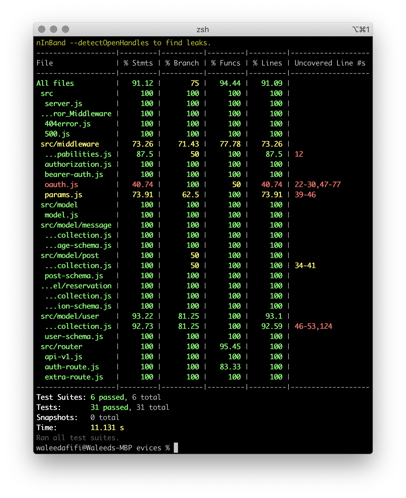
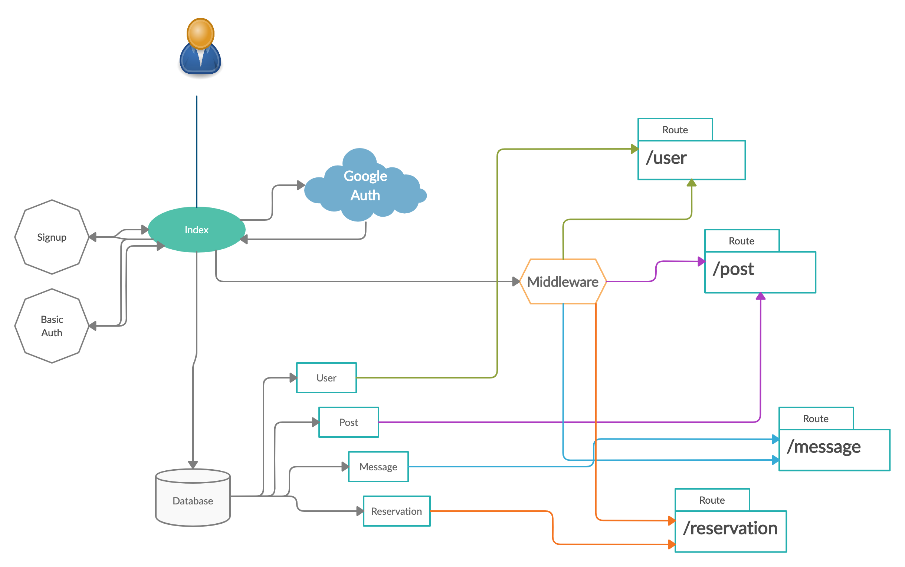

# <span style="color:#ff9a76; font-weight:700; font-size:24px">Evices</span>

The main feature of this website clients can contact the service providers, the provider can add services, and the client can comment on the service, add to favorite, and chat with the seller.

***
## <span style="color:#07689f">Team member</span>
1. [<span style="color:#84a9ac">Hussein AL Mohamad</span>](https://github.com/Hussein66253) <span style="font-size:24px">🙂</span>
1. [<span style="color:#3b6978">Nedal Erekat</span>](https://github.com/Nedal-Erekat) <span style="font-size:24px">🧐</span>
1. [<span style="color:#f09ae9">Sondos Matahen</span>](https://github.com/SondosMatahen) <span style="font-size:24px">🥳</span>
1. [<span style="color:#204051">Waleed A. Afifi</span>](https://github.com/waleedafifi90) <span style="font-size:24px">😑</span>


## User stories
1. As a user, I want to be able to login into the website.
1. As a user, I want to be able to login using Google.
1. As a user, I want to see all categories in the main page.
1. As a user, I want to select the service I need.
1. As a user, I want to be able to add multiple addresses.
1. As a user, I want to be able to book a service.
1. As a provider, I want to be able to add new services.
1. As a provider, I want to see all of my services as a list.
1. As a user, I want to send a message to providers.

## Wireframe
1. [Home](./wireframe/home.jpg)
2. [Services list](./wireframe/service-list.jpg)
3. [Single service page](./wireframe/single-page.jpg)
4. [Auth page]((./wireframe/auth.jpg))
5. [Reservation page](./wireframe/reservation.jpg)
6. [Chat page](./wireframe/chat.jpg)
7. [Contact us](./wireframe/contact-us.png) 
8. [About us](./wireframe/about-us.png)
9. Privacy and policy

## HTML pages
1. [Home](https://mr-code.com/evices/index.html)
2. [Single service page](https://mr-code.com/evices/service-provider-single.html)
3. [Signup page](https://mr-code.com/evices/register.html)
4. [Contact us](https://mr-code.com/evices/contact.html) 
5. [About us](https://mr-code.com/evices/aboutus.html)

## npm Package
- express
- morgan
- socket.io
- mongoose
- dotenv
- bcrybt
- jsonwebtoken
- jest
- @code-fellows/supergoose
- base-64
- cors
- superagent
- fs

## run app
```
// Using node
$ node .
$ node index.js

// Or using nodemon
$ nodemon .
```

## Chat test
After running th server you can go to the `http://localhost:3001` it will show a simple `HTML` page has an input to enter the username then click `join`, you can chat with others, to chat with specific user click on any username it will show another form to chat with that user.

## run test
```
$ npm run test
```

We covered more that 90% in the test from 31 test case



## .env file
```
PORT=3000
MONGOOSE_URL=mongodb://localhost:27017/401midproject
SECRET=evices
CLIENT_ID=82394101385-jaqm9i6p3cdu3i374lgg1b9ao6gfnpe3.apps.googleusercontent.com
CLIENT_SECRET=IBI9MQ0P5MTBZIyINtEQDDY0
```

## API Documentation
[Gitbook link](https://app.gitbook.com/@evices/s/evices-1/start)

## Process UML
